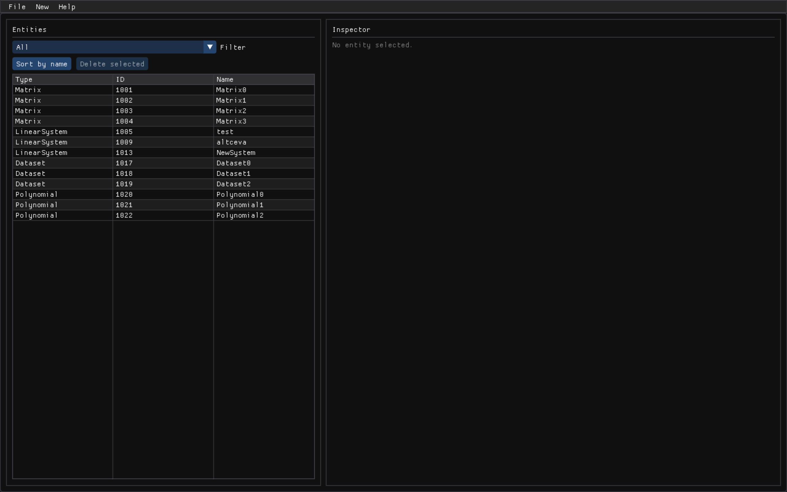
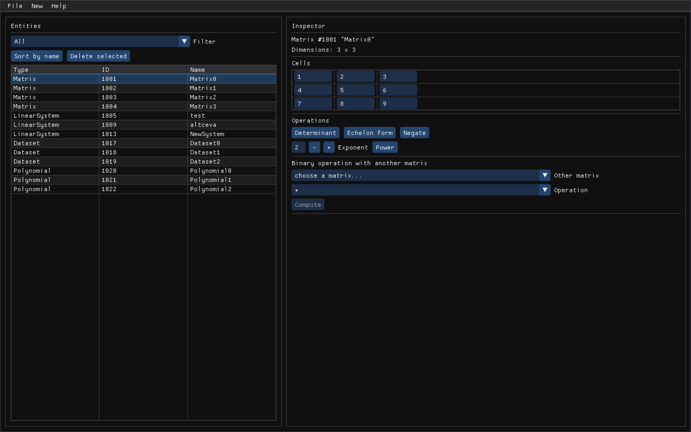
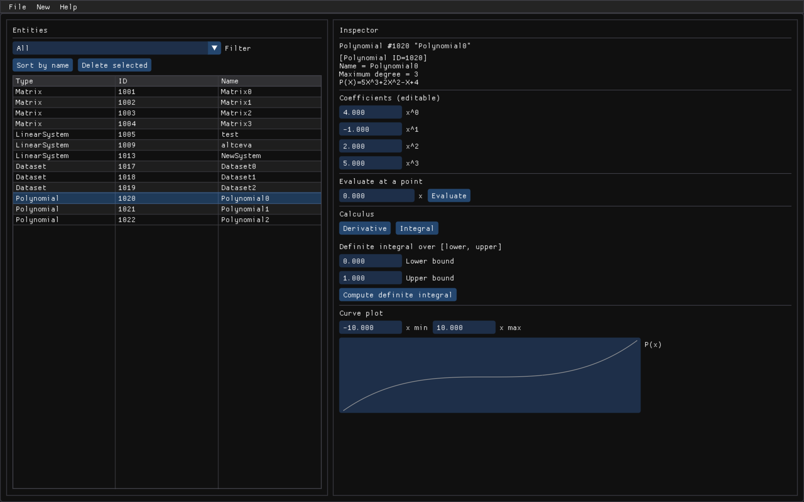
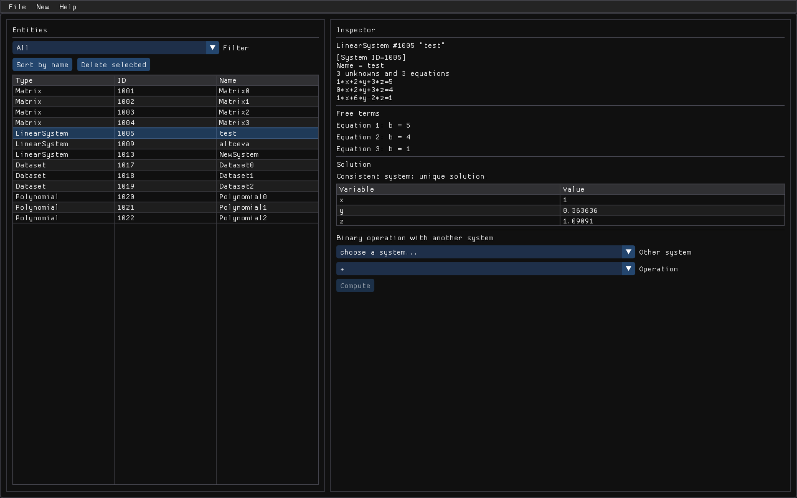
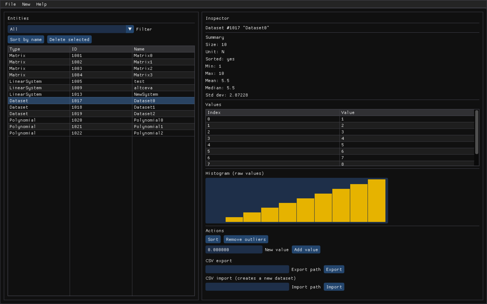

# MathLab

A C++17 application for working with **matrices**, **polynomials**, **systems of linear
equations**, and **statistical datasets**.

This started as my second project for the first-year **Object-Oriented Programming (POO)**
course at university, and grew into a full application with two front-ends: a terminal menu
system and a desktop GUI. Both share one implementation of the mathematics — neither computes
a determinant, solves a system, or parses a polynomial on its own.



---

## Contents

- [What it does](#what-it-does)
- [Quick start](#quick-start)
- [Building](#building)
- [Tutorial: using the GUI](#tutorial-using-the-gui)
- [Tutorial: using the console app](#tutorial-using-the-console-app)
- [File formats](#file-formats)
- [How the code is organised](#how-the-code-is-organised)
- [Class hierarchy](#class-hierarchy)

---

## What it does

| Entity | Operations |
|---|---|
| **Matrix** | add, subtract, multiply, scalar ops, concatenate, negate, power, transpose to echelon form, determinant, element access, comparisons |
| **Polynomial** | add, subtract, multiply, negate, derivative, integral, definite integral, evaluate at a point, root finding, curve plotting |
| **LinearSystem** | Gauss elimination with partial pivoting, Rouché–Capelli classification (unique / infinitely many / no solution), free-variable parametrisation |
| **Dataset** | min, max, mean, median, standard deviation, sorting, outlier removal, set union/difference/intersection, CSV import & export, histogram |

Everything can be saved to and loaded from a folder of plain-text files.

---

## Quick start

```sh
git clone https://github.com/edwarderzegovina/MathLab.git
cd MathLab
cmake -S . -B build
cmake --build build -j8

./build/mathlab-gui      # desktop GUI
./build/proiect02        # console app
```

The first `cmake -S . -B build` downloads GLFW and Dear ImGui automatically — you don't need
to install anything yourself.

---

## Building

### Prerequisites

- A **C++17** compiler (GCC 8+, Clang 7+, or MSVC 2019+)
- **CMake 3.16** or newer
- For the GUI only: an internet connection the first time you configure, and OpenGL
  (already present on macOS, Windows, and any Linux desktop)

Check what you have:

```sh
g++ --version
cmake --version
```

### Option 1 — both front-ends (default)

```sh
cmake -S . -B build
cmake --build build -j8
```

Produces `build/proiect02` (console) and `build/mathlab-gui` (GUI).

CMake fetches **GLFW 3.4** and **Dear ImGui v1.91.5** on the first configure and caches them
in `build/_deps/`. Later builds need no network.

### Option 2 — console + tests only, no internet needed

If you're on a machine with no network, or you only want the console app:

```sh
cmake -S . -B build -DMATHLAB_BUILD_GUI=OFF
cmake --build build -j8
```

This builds the core library and the console app with **zero** third-party dependencies.

### Option 3 — no CMake at all

The console app also builds with a single script:

```sh
./compile.sh
./build-simple/proiect02
```

### Dependencies

Exactly two, both used only by the GUI and both fetched automatically:

| Library | Version | Purpose |
|---|---|---|
| [GLFW](https://www.glfw.org/) | 3.4 | window creation and input |
| [Dear ImGui](https://github.com/ocornut/imgui) | v1.91.5 | the interface widgets |

The core library and the console app have **no** third-party dependencies.

> **macOS note:** the GUI requests an OpenGL 3.2 Core profile explicitly. Without that,
> macOS hands back a legacy 2.1 context and the shaders fail to compile. This is already
> handled in `src/gui/main.cpp` — mentioned only in case you're writing your own GLFW app
> and hit the same wall.

---

## Tutorial: using the GUI

```sh
./build/mathlab-gui
```

### 1. Load the sample data

**File → Load sample data** loads the `data/` folder: 4 matrices, 3 polynomials, 3 linear
systems, and 3 datasets. They appear in the **Entities** list on the left, which you can
filter by type and sort by name.

### 2. Inspect a matrix

Click any Matrix. The right pane shows an **editable grid** — click a cell and type to change
it. The buttons compute the determinant, reduce to echelon form, negate, or raise it to a
power. The bottom section combines it with another matrix (`+`, `-`, `*`, or concatenation).



### 3. Plot a polynomial

Select a Polynomial and its **curve is plotted immediately**. Adjust the x-range and it
replots. You can edit each coefficient, evaluate at a point, take the derivative or integral,
or compute a definite integral over an interval.



### 4. Solve a system

Select a LinearSystem and it **solves automatically**, showing each variable and its value.
For a system with infinitely many solutions it shows the parametrised form
(`x = 3 - 2*t1`) and lists the free parameters. An inconsistent system reports "no solution"
rather than an error.



### 5. Analyse a dataset

Select a Dataset for a value table, a **histogram**, and the full statistics — size, min, max,
mean, median, standard deviation. You can sort it, add values, remove outliers (values more
than 3σ from the mean), or import/export CSV.



### 6. Create your own

**New →** has an entry per type. A few things worth knowing:

- **Polynomials** accept natural notation: `3x^2+1` works, and so does `3*x^2+1`. Negative
  coefficients (`-4x^3+2`) and scientific notation (`1e6*x`) are fine too.
- **Linear systems** place coefficients **by variable name**, not by position — so in a
  two-variable system, `3*y=6` correctly means `0*x + 3*y = 6`.
- Anything invalid (a matrix bigger than 10×10, an unparseable polynomial) shows an error
  message in the corner instead of crashing.

### 7. Save your work

**File → Save workspace…**, type a folder name, and everything is written out. **File →
Load workspace…** reads it back.

---

## Tutorial: using the console app

```sh
./build/proiect02
```

You'll be asked whether to load an existing project. Answer `N` to start empty, or `Y` and
type `data` to load the samples.

The main menu:

```
1.Generic Interface          7.Go to the Linear Equations section
2.Algebra Interface          8.Load from folder
3.Data Interface             9.Save to folder
4.Go to the Dataset section  10.Show Log
5.Go to the Polynomials section  11.Quickly add read/identity entities
6.Go to the Matrices section 12.Exit the application
```

**A worked example — solving a system:**

1. Press `8`, then type `data` to load the samples.
2. Press `7` for the Linear Equations section.
3. Press `1` to list the systems and note an ID (for example `1005`).
4. Press `4` to solve, then enter that ID.

```
Consistent system: unique solution.
x = 1
y = 0.363636
z = 1.09091
```

Sections **4–7** hold the per-type operations; **1–3** are polymorphic views that work across
types (listing everything, solving any `AlgebraEntity`, summarising any `DataEntity`).
Press `12`, or Ctrl-D, to exit.

---

## File formats

A saved project is four plain-text files, all human-readable and hand-editable:

**`matrices.txt`** — rows, then columns, then the values:
```
3
3
1 2 3
4 5 6
7 8 9
```

**`polynomials.txt`** — one polynomial per line:
```
5*x^3+2*x^2-1*x+4
1*x-2
```

**`systems.txt`** — a name, then `equations variables`, then the equations:
```
test
3 3
1*x+2*y+3*z=5
0*x+2*y+3*z=4
1*x+6*y-2*z=1
```

**`datasets.txt`** — sorted flag, unit, count, then the values:
```
n N 10
1 2 3 4 5 6 7 8 9 10
```

Datasets can also be exchanged as CSV via the import/export buttons.

---

## How the code is organised

```
src/core/   the entities, Workspace, and every operation on them
src/cli/    the terminal menu system, built on core
src/gui/    the ImGui/GLFW desktop GUI, built on core
data/       sample project
```

`src/core` never prints and never prompts — it contains no `<iostream>` at all. The
`mathlab_core` CMake target doesn't even put `src/cli` or `src/gui` on its include path, so
it *cannot* reach a terminal or a window by accident.

`Workspace` (`src/core/Workspace.h`) owns every entity and performs every operation:
`matrixBinaryOp`, `polynomialDerivative`, `solveSystem`, `datasetRemoveOutliers`, and so on.
Each takes already-validated arguments and either returns a value or throws. It never prompts
and never prints — so the console drives it with a terminal and the GUI drives it with widgets,
without either duplicating a single line of the mathematics.

The solver is a good example of the split: instead of printing its answer, it returns a
`SolutionReport` struct carrying the classification, the values, and the parametrised
expressions. The console renders that as text; the GUI renders it as a table. One computation,
two presentations.

Parsing lives in core too, so both front-ends accept exactly the same input:
`Matrix::operator>>`, `Polynomial::operator>>`, `LinearSystem::operator>>` and
`Dataset::operator>>` each read from a plain `std::istream` and either populate the object or
throw a `MathLabException`. The console hands them `cin`; the GUI hands them an
`istringstream` built from a text field.

---

## Class hierarchy

```
IObject
  └── MathEntity            (adds a name and clone())
        ├── AlgebraEntity   (adds solve())
        │     ├── Matrix
        │     ├── Polynomial
        │     └── LinearSystem
        └── DataEntity      (adds summaryText())
              └── Dataset
```

- **`IObject`** — the root. Every object gets a unique id and must render itself via
  `toString()`. Identity is never copied: the copy constructor mints a fresh id, and
  assignment leaves the target's id untouched.
- **`MathEntity`** — adds a name and `clone()` for polymorphic copying.
- **`AlgebraEntity`** — anything you can *solve*.
- **`DataEntity`** — anything you can *summarise*.

The project also uses templates (`MathCache<T, N>` with an explicit specialisation,
`Workspace::ofType<T>()`), operator overloading throughout, a `MathLabException` hierarchy,
an abstract factory for building entities, and a Meyers singleton for the logger — the OOP
concepts the course covered, applied where they actually helped.

---

## License

MIT — see [LICENSE](LICENSE).
